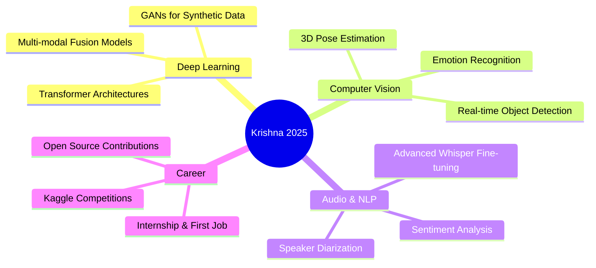

<div align="center">


<br/>

[](https://github.com/krishnaprasad2217-design)
[](https://github.com/krishnaprasad2217-design)
[](mailto:krishnaprasad2217@gmail.com)
[](#)

</div>

---

## 🧑‍💻 About Me

```python
class KrishnaPrasad:
    name        = "krishnaprasad s"
    pronouns    = "he/him"
    location    = "Kottayam, Kerala, India 🌴"
    education   = "Final-Year B.Tech — Computer Science"
    email       = "krishnaprasad2217@gmail.com"

    skills      = ["Machine Learning", "Deep Learning", "Computer Vision",
                   "Python", "UI/UX Design", "Audio/NLP Processing"]

    currently   = "Built a real-time AI Lie Detection system (CNN + RNN + Whisper) 🧠"
    interests   = ["AI Research", "Human Behaviour Analysis", "Forensic Tech", "Design"]
    seeking     = "Internships & Entry-Level Roles in AI/ML or Computer Vision"
    fun_fact    = "I built a Courtroom AI that can detect deception in real-time 🕵️"
```

> *"The best way to predict the future is to invent it."* — Alan Kay

I'm a **final-year B.Tech Computer Science student** from the beautiful backwaters of Kottayam, Kerala 🌴. I'm deeply passionate about **Artificial Intelligence** and **Computer Vision** — building systems that perceive, understand, and reason about human behaviour. My latest work is **Courtroom AI**, a multimodal real-time lie detection system that fuses visual, postural, and audio signals to generate a composite deception score.

- 🧠 Building **AI/ML systems** using CNN architectures, MediaPipe & OpenAI Whisper
- 👁️ Specializing in **Computer Vision** — eye tracking, gaze estimation, facial analysis
- 🎨 Designing clean **UI/UX** interfaces with dark forensic aesthetics (Tkinter, Figma)
- 🔊 Working with **audio/NLP** — speech-to-text, speech rate analysis
- 💼 Actively looking for **internships / full-time opportunities** in AI/ML
- 📧 Reach me: **[krishnaprasad2217@gmail.com](mailto:krishnaprasad2217@gmail.com)**

---

## 🛠️ Tech Stack & Skills

### 🧠 AI / Machine Learning / Computer Vision
<p align="left">
  
  
  
  
  
  
  
  
  
  
  
</p>

### 🔊 Audio / NLP
<p align="left">
  
  
  
</p>

### 🎨 UI/UX & Frontend
<p align="left">
  
  
  
  
  
  
</p>

### 🗄️ Databases & Tools
<p align="left">
  
  
  
  
  
  
  
  
</p>

---

## 🚀 Featured Projects

---

### 🕵️ Courtroom AI — Real-Time Multimodal Lie Detection System

> *"The most advanced deception detection system built using Computer Vision, Deep Learning & NLP."*

<p align="left">
  
  
  
  
  
  
</p>

**Courtroom AI** is a sophisticated real-time lie detection system that analyzes **five simultaneous behavioural channels** from webcam and microphone to compute a composite deception (lie) score. The system was designed with a dark forensic UI theme and supports both live webcam analysis and pre-recorded video file analysis.

#### 🔬 How It Works — Detection Modules

| Module | Description | Signal Used |
|--------|-------------|-------------|
| 👁️ **Eye Blink Detector** | Tracks Eye Aspect Ratio (EAR) using MediaPipe FaceMesh (6 eyelid landmarks per eye). Flags abnormal blink rates — too fast or suppressed blinking indicates stress | Blink rate over 5-sec rolling window |
| 🎯 **Eyeball / Gaze Tracker** | Tracks iris centers using MediaPipe landmarks (468–477). Detects LEFT/RIGHT/UP/DOWN gaze deviation from neutral. Persistent gaze aversion flags deception | Iris centroid relative to eye bounding box |
| 🧭 **Head Pose Estimator** | Solves PnP (Perspective-n-Point) with 6 facial landmarks to compute real 3D pitch, yaw, roll angles. Calibrates a neutral baseline; flags sustained yaw deviation > ±30° | 3D rotation vector (yaw aversion events) |
| 💪 **Shoulder Analyser** | Uses MediaPipe Pose to track shoulder landmarks (indices 11 & 12). Detects shrugs (raise > 50px from baseline) and asymmetry (>8% difference) as stress fidgets | Shoulder Y-coordinate variance |
| 🔊 **Audio / Speech Analyser** | Records live microphone audio, transcribes using **OpenAI Whisper**, measures speech rate (words/sec). Unusually low word count or speech rate flags evasive answers | Word count, speech rate thresholding |

#### 🧮 Composite Lie Score Formula

```
Lie Score = (Blink Rate × 10) + (Head Aversion Events × 20) + (Shoulder Fidget Events × 15)
```
Each channel also produces an independent binary flag. The final verdict is determined by combining all channel flags.

#### ✨ Key Features

- 🖥️ **Full GUI** built with Tkinter — dark forensic "Courtroom AI" theme with teal accent (`#00e5c0`)
- 🔐 **Login screen** with adaptive window sizing (90% of screen resolution)
- 📹 Supports **live webcam** and **pre-recorded `.avi` video** analysis
- 🎙️ **Live microphone recording** with WAV output and Whisper transcription
- 🔄 **Shared FaceMesh instance** across modules (optimized for performance)
- 📊 Real-time on-screen overlays — blink count, lie score, gaze direction, head angles
- 📁 **Analysis reports** saved to `/analysis/` folder
- ⌨️ Keyboard controls: `q` to quit, `SPACE` to pause/resume video

#### 📦 Tech Stack

```
Python 3.9 · MediaPipe 0.10.5 · OpenCV · NumPy · SciPy · Matplotlib
OpenAI Whisper · FER (Facial Emotion Recognition) · scikit-learn
SoundDevice · Pillow · Tkinter
```

<p align="left">
  <a href="https://github.com/krishnaprasad2217-design">
    
  </a>
</p>

---

### 🎨 UI/UX Design Portfolio *(Coming Soon)*

<p align="left">
  
  
  
</p>

A curated collection of UI/UX design projects including mobile app mockups, web interfaces, and design systems — crafted with user-centric principles and modern aesthetics.

---

## 🎓 Education

| 🎓 Degree | 🏫 Institution | 📅 Year | 📍 Location |
|-----------|----------------|---------|-------------|
| B.Tech — Computer Science | [Your College Name] | 2021 – 2025 | Kottayam, Kerala |
| Higher Secondary (XII) | [Your School Name] | 2019 – 2021 | Kerala |

---

## 📊 GitHub Stats

<div align="center">


<br/>


<br/>


</div>

---

## 🏆 GitHub Trophies

<div align="center">
  
</div>

---

## 🧭 2025 Learning Roadmap



---

## 🌟 Core Competencies

<div align="center">


</div>

---

## 🌐 Connect With Me

<div align="center">

[](mailto:krishnaprasad2217@gmail.com)
[](https://linkedin.com/in/krishnaprasad2217)
[](https://github.com/krishnaprasad2217-design)
[](https://instagram.com/krishnaprasad2217)
[](https://kaggle.com/krishnaprasad2217)

</div>

---

## 💬 Dev Quote of the Day

<div align="center">
  
</div>

---

<div align="center">


**🚀 "From Kottayam to the World — One Commit at a Time" 🌴**

*Built with ❤️ by krishnaprasad s | Kottayam, Kerala, India*

⭐ **If you find my work interesting, drop a star — it means the world!** ⭐

</div>
